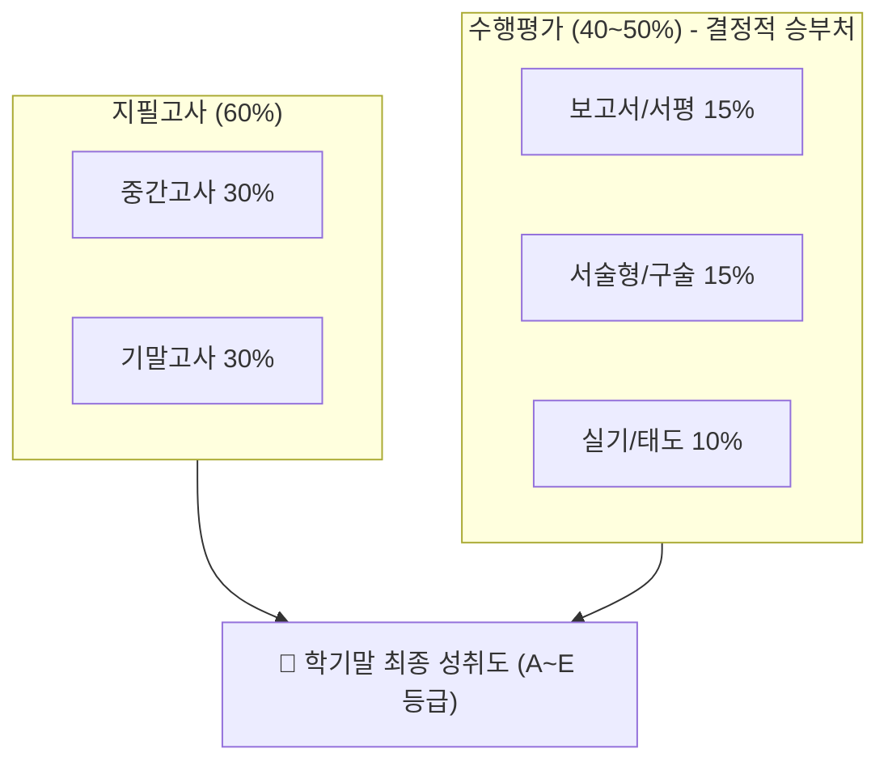
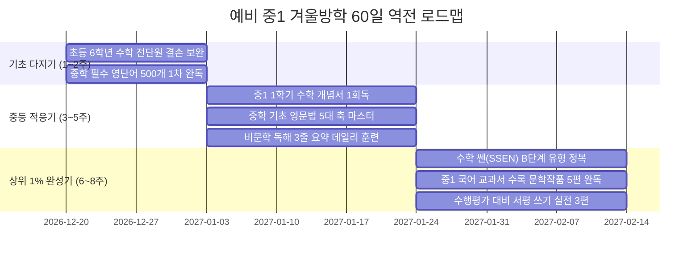

# 《꿈을 여는 공부의 새벽》
### - 예비 중학생을 위한 빛나는 시작 : 자기주도 학습법과 미래의 로드맵 -

> **부제**: 초등 올백의 함정에서 벗어나 중학교 첫 시험 전교 1등으로 도약하는 상위 1% 실전 비법서  
> **대상**: 대한민국 초등학교 6학년 학생 & 예비 중1 학부모  
> **판본**: 2026-2027 최신 2022 개정 교육과정 반영판  
> **지은이**: 6학년 3반 담임 선생님  
> **정가**: 70,000 미소 (경제앱으로 박희망에게 입금)  
> **발행**: 6학년 3반 교실 연구소

---

# 📌 [프롤로그] 초등 100점의 배신과 중학 성적의 숨겨진 메커니즘

### 1. 초등 단원평가 100점의 위험한 착시
초등학교 시절 성적표에 찍힌 '매우 잘함'과 단원평가 100점 시험지들을 보며 안도하셨습니까? 냉정하게 말씀드립니다. 그것은 아이의 진짜 실력이 아니라 **‘단기 기억의 착시’**입니다.

초등학교 시험의 특징:
- 시험 범위가 교과서 20~30페이지 내외로 극히 좁습니다.
- 문제의 난이도가 '개념의 단순 확인(단답형)'에 그칩니다.
- 시험 전날 문제집 5장만 풀어도 90점 이상이 나옵니다.
- 학급 25명 중 15명 이상이 90점 이상을 받습니다.

그러나 중학교 첫 중간고사를 치르는 순간, 학부모와 학생은 거대한 충격에 휩싸입니다.
- **시험 범위의 폭발**: 교과서 2~3개 단원 전체, 부교재, 프린트물까지 150페이지가 넘는 분량이 한꺼번에 쏟아집니다.
- **복합 사고력 문제**: 단순 암기로는 손도 댈 수 없는 '원인-과정-결과'를 묻는 서술형/논술형 문항이 30% 이상 출제됩니다.
- **성적의 추락**: 초등 때 95점 밑으로 내려간 적 없던 아이가 **중1 첫 시험에서 50점~60점대 성적표**를 받아 들고 방에서 눈물을 쏟아냅니다.

---

### 2. 점수의 절반을 가르는 복병: '수행평가(40~50%)'의 수학적 실체
많은 학부모님들이 지필고사(중간·기말고사)에만 매달리다 치명적인 패배를 맛봅니다.  
중학교 내신 성적 산출 공식을 들여다보십시오.

$$\text{최종 성적} = (\text{중간 지필} \times 0.3) + (\text{기말 지필} \times 0.3) + (\text{수행평가} \times 0.4)$$



**[충격적인 실제 사례 비교]**
- **학생 A**: 지필고사 95점, 수행평가 감점(-8점) → **최종 87점 (B등급 추락!)**
- **학생 B**: 지필고사 86점, 수행평가 만점(40점 확보) → **최종 91.6점 (A등급 달성!)**

지필고사에서 고난도 킬러 문항 2개를 더 맞히려고 수십 시간을 쓰는 것보다, **수행평가에서 깎이는 3~5점을 사전에 완벽히 방어하는 것**이 A등급(상위 1%)을 확정 짓는 가장 빠르고 확실한 비결입니다.

---

# 🧭 [Part 1] 중학교 수행평가 감점 0점 공식 (루브릭 역분석)

선생님은 주관적으로 점수를 주지 않습니다. 교육청 지침에 따라 사전에 공시되는 **'루브릭(Rubric, 채점 기준표)'**에 의해 기계적으로 채점합니다. 상위 1%는 학기 초 학교 알리미와 교과 게시판에 공개되는 이 루브릭을 먼저 해킹합니다.

---

### 1. 국어·사회 수행평가: 서평 및 논술 보고서 만점 템플릿
- **감점 1위 원인**: 줄거리만 장황하게 나열하고, 자신의 생각이나 비판적 근거가 부실함.
- **만점 공식 [PREP 서술 4단계 구조]**:
  1. **P (Point - 주장)**: "나는 주인공의 선택이 당시 사회적 한계를 극복하지 못한 결정이었다고 본다." (결론을 첫 문장에 두괄식 배치)
  2. **R (Reason - 이유)**: "왜냐하면 당시 신분제 사회에서는 개인의 능력보다 출신이 우선시되었기 때문이다."
  3. **E (Example - 구체적 근거)**: "작중 3장에서 주인공이 과거 시험을 치르지 못하고 좌절했던 장면이 이를 명확히 보여준다."
  4. **P (Point - 결론 및 현재적 적용)**: "따라서 이 작품은 오늘날 우리 사회의 기회균등 문제에도 시사하는 바가 크다."

---

### 2. 과학 수행평가: 탐구 실험 보고서 만점 공식
- **감점 1위 원인**: 실험 과정만 쓰고 '변인 통제'와 '오차 분석'을 빠뜨림.
- **보고서 필수 4요소 체크리스트**:
  - [ ] **조작 변인**: 의도적으로 변화시킨 조건 1가지를 명확히 썼는가? (예: 온도를 20도, 40도, 60도로 변경)
  - [ ] **통제 변인**: 일정하게 유지한 조건 3가지 이상을 명시했는가? (예: 액체의 양, 비커 크기, 교반 속도 동일)
  - [ ] **종속 변인**: 측정하고자 하는 결과값을 정량적 수치(표, 그래프)로 기록했는가?
  - [ ] **오차 분석**: 가설과 결과가 다를 때 단순 실패가 아닌 "실험 기구의 열 손실로 인해 오차가 발생했다"는 원인을 분석했는가? (선생님이 최고점을 주는 포인트!)

---

### 3. 영어 수행평가: 1분 스피치 & 영작 감점 방지 3계명
1. 교과서 핵심 문법(예: to부정사의 형용사적 용법, 관계대명사 which)을 발표 스크립트에 최소 2회 이상 의도적으로 삽입한다.
2. 발표 시 대본을 그대로 읽으면 '태도 점수'에서 2점 감점된다. 핵심 키워드만 적은 인덱스 카드를 보고 청중(선생님)과 아이컨택을 3회 이상 한다.
3. 제출 전 파파고나 챗GPT로 문법 검수를 거치되, 반드시 '스펠링 오류'와 '3인칭 단수 -s/es 누락'을 붉은 펜으로 자가 점검한다.

---

# 📚 [Part 2] 과목별 상위 1% 초격차 실전 공부법

---

### 1. 수학 (Mathematics): '양치기'를 멈추고 '개념의 언어화'를 시작하라
초등 수학은 연산 속도 싸움이었지만, 중등 수학은 **추상적 논리(음수, 미지수 $x$, 함수)**의 세계입니다. 문제를 많이 푼다고 점수가 오르지 않습니다.

#### ① 백지 개념 복습법 (The Feynman Technique)
- 단원이 끝나면 아무것도 적히지 않은 A4 백지를 꺼냅니다.
- 단원명(예: '정수와 유리수')만 적고, 교과서를 덮은 상태에서 아래 질문에 답을 적습니다.
  - "음수란 무엇이며, 수직선에서 왜 0의 왼쪽에 위치하는가?"
  - "절댓값의 정확한 정의는 무엇인가? (원점과의 거리)"
  - "음수 곱하기 음수는 왜 양수가 되는가?"
- 이것을 초등학교 동생에게 3분 동안 막힘없이 설명할 수 없다면, 그 단원은 공부한 것이 아닙니다.

#### ② 전교 1등의 3색 오답노트 시스템
오답노트에 문제를 예쁘게 오려 붙이지 마십시오. 시간 낭비입니다.
- **검정펜**: 내가 실제 시험/문제풀이에서 푼 잘못된 식을 그대로 쓴다. (어느 단계에서 계산 실수나 개념 왜곡이 있었는지 빨간 형광펜으로 동그라미)
- **파란펜**: 이 문제를 푸는 데 결정적이었던 '출제자의 핵심 개념 키워드'를 한 줄로 적는다. (예: "두 점 사이의 거리 공식 활용")
- **초록펜**: 3일 뒤 다시 백지에 풀었을 때 완벽히 풀렸는지 검산 날짜와 확인 서명을 남긴다.

#### ③ 수준별 추천 교재 로드맵
- **개념 다지기**: 《개념원리 중학수학》 또는 《체크체크 수학》 (초6 겨울방학 필수 1회독)
- **유형 정복**: 《쎈(SSEN) 중학수학》 B단계 집중 풀이 (C단계에 집착하지 말 것)
- **심화 완성**: 중1 첫 시험 4주 전, 학교 기출 족보닷컴 최신 3개년 오답 분석

---

### 2. 영어 (English): 내신 문법 5대 축과 교과서 통영작
중학교 영어 시험은 회화가 아닙니다. **‘철저한 문법 규칙에 기반한 서술형 영작’**입니다.

#### ① 중학 영문법 5대 핵심 기둥 마스터
초6 겨울방학 60일 동안 아래 5가지만 완벽히 뼈대를 세우면 중3까지 흔들리지 않습니다.
1. **문장의 5형식**: 주어, 동사, 목적어, 보어의 자리 구분
2. **시제 (Tense)**: 현재완료(have+p.p.)의 4가지 용법(완료, 경험, 계속, 결과)
3. **to부정사와 동명사**: 목적어로 취하는 동사 구분 (want는 to, enjoy는 -ing)
4. **조동사**: can, may, must, should의 미묘한 뉘앙스 차이
5. **관계대명사**: who, which, that의 선행사 일치와 생략 규칙

#### ② 영단어 '망각곡선 3일 누적 암기법'
- 하루 30개씩 외우고 잊어버리는 주입식 암기는 효과가 없습니다.
- **Day 1**: 단어 1~30번 암기 (15분)
- **Day 2**: 단어 1~30번 가리고 5분 복습 + 신규 31~60번 암기 (15분)
- **Day 3**: 단어 1~60번 가리고 누적 테스트 + 신규 61~90번 암기 (15분)
- 주말(토/일): 일주일간 누적된 150개 중 틀린 단어만 모아 '나만의 단어장' 제작

---

### 3. 국어 & 과학: 비문학 독해력과 탐구 인과관계의 정복
사회와 과학에서 점수가 깎이는 학생의 80%는 지식이 없어서가 아니라, **문제의 어휘를 해석하지 못해서** 틀립니다.

#### ① 초등 6학년이 반드시 알아야 할 중등 필수 한자 어휘 20선
| 어휘 | 뜻 | 교과서 출제 예시 |
|---|---|---|
| **개연성** | 일어날 가능성 | "소설 속 사건 전개의 개연성을 평가하시오." |
| **귀납 / 연역** | 개별 사례 → 결론 / 대전제 → 결론 | "글쓴이의 논증 방식이 귀납적인지 연역적인지 구분하시오." |
| **등방성 / 이방성** | 방향에 따른 성질의 동일 여부 | "광물의 물리적 성질 중 등방성을 서술하시오." |
| **기회비용** | 하나를 선택함으로써 포기한 가치 | "합리적 선택에서 기회비용을 계산하시오." |
| **수탈 / 침탈** | 강제로 빼앗음 | "일제의 토지조사사업에 따른 경제적 수탈 양상" |

#### ② 과학: '용어 암기'가 아니라 '실험 스토리보드'를 그려라
- 중등 과학은 물리(힘과 운동), 화학(물질의 상태 변화), 생명(소화·순환·호흡·배설), 지구과학(지권과 판구조론) 4대 영역으로 나뉩니다.
- **실전 3단계 과학 공부법**:
  1. **실험 기구와 과정 만화화**: 교과서 속 실험(예: 보일의 법칙, 샤를의 법칙 주사기 실험)을 4컷 만화 형태로 공책에 그립니다.
  2. **원인과 결과의 화살표 연결**: "온도 상승 → 기체 분자 운동 활발 → 충돌 횟수 증가 → 부피 팽창"처럼 반드시 화살표 인과율로 정리합니다.
  3. **공식의 단위(Unit) 뜯어보기**: $N, m/s^2, g/cm^3$ 등 단위의 분모·분자 관계를 이해하면 공식을 외우지 않아도 문제가 저절로 풀립니다.

---

### 4. 역사 (History - 한국사 & 세계사): 연도 외우지 마라, '인과관계 3단 트리'로 뚫어라
초등학교 때는 "몇 년도에 무슨 일이 일어났다"는 단순 사실만 배웠지만, 중학교 역사는 **'왜 그 사건이 일어났고, 그 결과 사회가 어떻게 바뀌었는가'**를 묻습니다.

#### ① 연도 암기를 대체하는 '3단 트리 노트법'
- 공책 1페이지를 가로로 3등분합니다.
  - **[1단: 배경]**: 당시 지배층의 부패, 대외 침략, 경제적 곤핍 (원인)
  - **[2단: 전개]**: 핵심 인물과 결정적 전투/법령 선포 (사건의 폭발)
  - **[3단: 결과 및 영향]**: 새로운 신분제 등장, 조세 제도 개혁, 왕권 강화 (사회 변화)
- 이 3단 흐름만 머릿속에 도식화되면, 서술형 주관식 10점짜리 문제도 완벽한 문장으로 적어낼 수 있습니다.

#### ② 사료(史料) 및 지도 분석 킬러 문항 대비
- 시험 문제의 40%는 교과서 구석에 실린 '삼국사기 사료 발췌문'이나 '영토 지도'에서 출제됩니다.
- 교과서 본문만 읽지 말고, 지도 아래의 작은 범례와 사료 박스의 밑줄 친 핵심 단어(예: "진대법", "녹읍 폐지")를 형광펜으로 체크하는 습관이 전교 1등의 갈림길입니다.

---

### 5. 도덕 (Ethics): 상식 시험이 아니다! 사상가 키워드 매칭과 딜레마 논술
초등학교 도덕은 "착하게 살자"는 도덕적 태도였지만, 중학교 도덕은 **동서양 윤리 철학의 기초**입니다. 대충 상식으로 풀었다가 70점을 맞고 충격받는 대표적 과목입니다.

#### ① 서양 2대 윤리 사상 3초 구분법
- **의무론 (칸트)**: "결과가 아무리 좋아도 거짓말은 무조건 잘못이다!" → **동기, 절대적 도덕 법칙, 무조건적 명령(정언명령)**이 키워드.
- **공리주의 (벤담·밀)**: "1명이 희생해서 99명이 행복하다면 옳은가?" → **결과, 최대 다수의 최대 행복, 유용성**이 키워드.

#### ② 도덕 서술형 만점 팁
- 도덕 서술형 평가는 자신의 착한 감정을 쓰는 것이 아닙니다. 반드시 교과서에 등장하는 **철학적 개념어(예: 역지사지, 보편화 가능성, 절차적 정의, 배려 윤리)**를 답안 문장에 정확히 포함해야 감점 없이 만점을 받습니다.

---

### 6. 기술·가정 (Home Economics & Tech): 지필고사의 복병, 도면 작도와 영양소 대사
주요 과목을 다 맞고도 '기가'에서 감점을 당해 전교 석차가 밀리는 비극이 매년 발생합니다.

#### ① 기술 영역: '투상법 도면' 완벽 정복
- 중1 기술에서 가장 많은 오답이 나오는 부분은 **등각투상법(120도 각도 입체도)**과 **정투상법(정면도·평면도·측면도 제3각법)**입니다.
- 초6 겨울방학 때 쌓기나무 블록이나 마인크래프트 블록을 위, 앞, 옆에서 바라본 투시도를 직접 눈금 공책에 그려보는 훈련을 1시간만 해두면 중학교 3년 내내 기술 만점을 유지합니다.

#### ② 가정 영역: 청소년기 신체 발달과 균형 잡힌 식단
- 영양소의 기능(탄수화물/단백질/지방의 열량 4-4-9 kcal, 무기질/비타민의 결핍증)을 표로 암기하고,
- 실습 평가(바느질, 조리 실습)에서는 결과물의 완성도보다 **안전 수칙 준수와 뒷정리 태도**가 배점의 30%를 차지한다는 사실을 명심해야 합니다.

---

### 7. 정보 (Informatics / SW & AI): 2022 개정 필수 과목! 컴퓨팅 사고력과 수행 100%
2022 개정 교육과정에서 정보 과목의 시수가 2배로 확대되었습니다. 단순 타이핑이 아니라 **'알고리즘과 파이썬/엔트리 프로그래밍'** 실습입니다.

#### ① 수행평가 만점 코드의 조건
1. **문제 분해 능력**: 복잡한 문제를 '입력 → 처리 → 조건 분기 → 반복 → 출력'의 순서도로 먼저 그리기.
2. **코드 가독성과 주석(Comment)**: 엔트리 블록이나 파이썬 코드 각 줄마다 "이 변수는 점수를 누적하는 변수임"이라는 주석을 달아 제출하면 가산점을 받습니다.
3. **디버깅 태도**: 에러가 났을 때 당황하지 않고 에러 메시지 라인을 찾아 수정하는 과정을 보고서에 기록하는 것이 핵심 평가 항목입니다.

---

### 8. 한문 (Classical Chinese): 사교육 없이 전 과목 성적을 10점 올리는 치트키
한문은 선택 과목이지만, 국어·사회·역사·과학 모든 교과서 어휘의 70% 이상이 한자어로 구성되어 있습니다.

#### ① 부수 214개 중 빈출 30개로 1,000자 유추하기
- 삼수변(氵, 물): 江(강), 海(바다), 泳(헤엄칠 영) → 물과 관련된 뜻!
- 마음심(忄, 마음): 快(쾌할 쾌), 恨(한할 한), 悟(깨달을 오) → 감정/심리와 관련된 뜻!
- 부수의 원리만 알면 교과서에 낯선 단어가 나와도 문맥 속에서 90% 이상 뜻을 유추해 낼 수 있습니다.

#### ② 중등 필수 고사성어 Best 10
- 조삼모사(朝三暮四), 전화위복(轉禍爲福), 역지사지(易地思之), 주마간산(走馬看山), 온고지신(溫故知新) 등 국어 교과서 단골 출제 성어 10개는 유래와 함께 완벽히 숙지합니다.

---

### 9. 음악·미술·체육 (예체능): 지필 없는 100% 수행평가, '태도 점수'가 전부다
중학교 예체능은 타고난 재능보다 **'성실성과 태도 루브릭'**이 성적을 결정합니다.

1. **체육 (PAPS 학생건강체력평가 1등급 팁)**:
   - 오래달리기-걷기(셔틀런)와 유연성(좌전굴)은 겨울방학 60일 동안 매일 저녁 줄넘기 500개와 스트레칭 10분만 실천해도 누구나 1~2등급을 받습니다.
2. **음악 (악기 실기 평가)**:
   - 리코더, 단소, 우쿨렐레 등 학교 지정 악기는 박자를 틀려도 멈추지 않고 끝까지 완주하는 '자신감'과 '자세'가 감점을 막습니다.
3. **미술 (발상과 표현)**:
   - 그림을 잘 그리지 못해도 상관없습니다. 스케치북 구석에 "내가 이 그림을 통해 전달하고자 한 메시지와 색채 의도"를 3줄 설명문으로 작성해 제출하면 최고 등급의 창의성 점수를 받습니다.

---

# ⏰ [Part 3] 초6 겨울방학 60일 완벽 역전 루틴 플래너

### 1. 스마트폰 도파민 디톡스 '30-10-30 법칙'
공부 효율을 떨어뜨리는 가장 큰 주범은 책상 위에 놓인 스마트폰입니다.
- **원칙**: 공부가 시작되는 순간 스마트폰은 전원을 끄고 거실 바구니에 넣습니다.
- **30분 집중**: 타이머를 30분 맞추고 오직 한 과목의 책과 노트만 봅니다.
- **10분 리프레시**: 뇌의 피로를 풀기 위해 물을 마시거나 가벼운 스트레칭을 합니다. (스마트폰 확인 절대 금지!)
- **30분 복습**: 방금 공부한 내용을 백지에 3분간 요약하고 다음 진도를 나갑니다.

---

### 2. 겨울방학 8주차 실전 완성 로드맵



---

### 3. [출력용] 예비 중1 데일리 몰입 스터디 플래너 서식
*(※ 본 서식을 복사하여 매일 아침 책상 위에 올려두고 사용하세요)*

```text
======================================================================
[ 📅 일자: 202 년   월   일 (   요일) ]  오늘의 집중도: [ ★ ★ ★ ★ ★ ]
오늘의 다짐: "시작하지 않으면 아무것도 변하지 않는다!"
======================================================================
[ 🎯 오늘의 3대 핵심 목표 (Must-Do) ]
1. [수학] 
2. [영어] 
3. [국어/기타] 
----------------------------------------------------------------------
[ ⏱️ 30-10-30 집중 블록 기록 ]
• 1교시 (09:00~09:30) 과목: [        ] 달성률: [  ]% (백지복습 여부: O/X)
• 2교시 (09:40~10:10) 과목: [        ] 달성률: [  ]% (오답노트 여부: O/X)
• 3교시 (10:20~10:50) 과목: [        ] 달성률: [  ]% (단어 암기 여부: O/X)
• 4교시 (11:00~11:30) 과목: [        ] 달성률: [  ]% (독해 요약 여부: O/X)
----------------------------------------------------------------------
[ 💡 오늘 발견한 취약점 & 내일 보완할 점 ]
- 
======================================================================
```

---

# 🎁 [부록 1: 학생 전용] 책상에 붙이는 '중학교 전교 1등 십계명'

1. **선생님의 목소리 톤이 바뀌는 순간이 곧 시험 문제다.**
2. **수행평가는 당일 시작해서 마감 3일 전에 끝낸다.**
3. **틀린 문제는 버리지 않고, 오답노트에 3번 다시 푼다.**
4. **쉬는 시간 1분 동안 선생님께 드리는 질문 하나가 등급을 바꾼다.**
5. **공부할 때 스마트폰은 방 밖으로 치운다.**
6. **남에게 설명할 수 없는 지식은 가짜 지식이다.**
7. **시험 2주 전에는 새로운 문제를 풀지 않고 교과서와 노트를 회독한다.**
8. **친구와 성적으로 경쟁하지 말고, 어제의 나보다 1장 더 푸는 것으로 경쟁한다.**
9. **매일 밤 11시 전에는 자서 뇌가 지식을 정리할 시간을 준다.**
10. **"나는 반드시 내가 꿈꾸는 중학교 생활을 해낼 수 있다"고 매일 아침 거울을 보며 외친다.**

---

# 🎁 [부록 2: 학부모 전용 바이블] 사교육비 500만 미소 아끼는 중등 3년 입시 가이드

### 1. 2028 대입 개편안과 중등 내신의 연결고리
- **통합형 수능 도입**: 문·이과 구분 없이 공통국어, 공통수학, 통합사회, 통합과학을 응시합니다.
- **시사점**: 특정 과목만 앞서가는 편식 선행은 필패합니다. 중학교 때 사회와 과학의 기본 개념을 소홀히 한 학생은 고등학교 1학년 통합사회·통합과학에서 등급이 무너집니다.

### 2. 학원 상담 시 원장의 기선을 제압하는 3대 역질문
대형 학원 설명회에서 비싼 심화반을 강요할 때 아래 3가지 질문을 던지십시오.
1. *"이 수업에서 우리 아이가 틀린 오답에 대해 1:1로 원인을 분석해 주는 피드백 시간이 주당 몇 분 배정되어 있습니까?"*
2. *"단순히 진도를 빼는 선행입니까, 아니면 개념을 스스로 백지에 유도하는 구술 테스트를 통과해야 다음 단원으로 넘어갑니까?"*
3. *"학교별 수행평가 루브릭에 맞춘 서술형 첨삭 지도가 커리큘럼에 포함되어 있습니까?"*

### 3. 사춘기 자녀와 절대로 싸우지 않는 '기적의 대화법 5원칙'
| ❌ 부모의 금기어 (싸움 유발) | ⭕ 마법의 공감어 (자기주도 자극) |
|---|---|
| "공부 다 했어? 휴대폰 그만해!" | "오늘 계획한 것 중에 가장 재미있었던 건 뭐야?" |
| "초등학교 땐 100점 맞더니 왜 이래?" | "중학교 시험이 많이 어렵지? 어떤 과목이 제일 헷갈렸어?" |
| "너 커서 뭐 되려고 그래?" | "네가 원하는 목표를 위해 엄마가 뭘 도와주면 좋을까?" |
| "옆집 민수는 이번에 수학 선행 끝냈대." | "다른 사람 신경 쓰지 말자. 지난달보다 네가 성장한 게 제일 중요해." |
| "내가 너 학원비로 얼마를 쓰는데!" | "너를 믿으니까 하는 투자야. 힘들면 언제든 털어놓으렴." |

---
*본 도서의 지식 재산권은 6학년 3반 교실 연구소에 있으며, 구매자 본인 외 무단 유출 및 복제를 엄격히 금합니다.*

